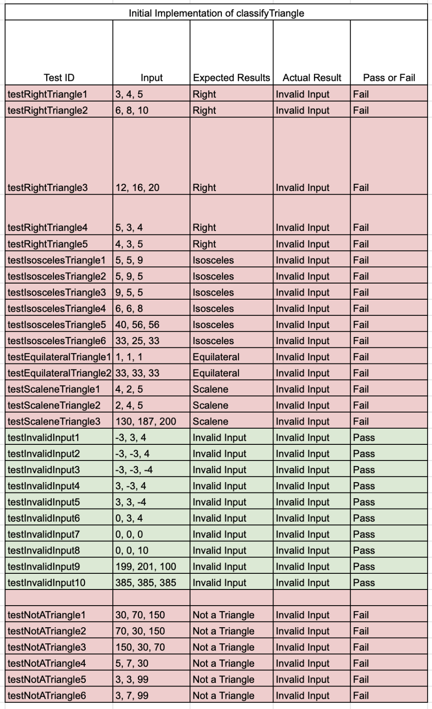
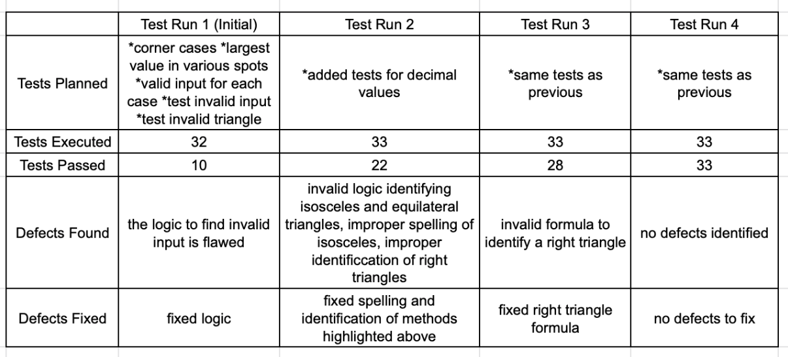
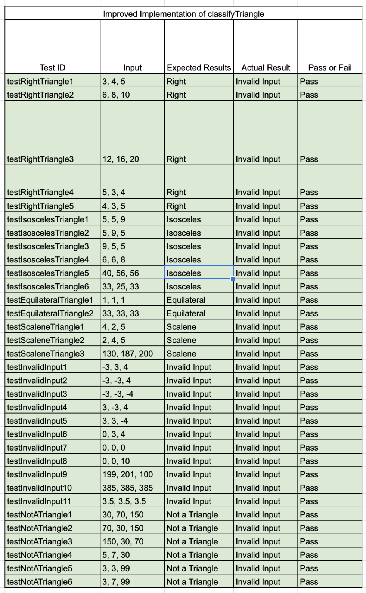

# Homework 02a: Assignment Summary
## Olivia Powers
## "I pledge my honor that I have abided by the Stevens Honor System." -OP

### Assignment Description 
Sometimes you will be given a program that someone else has written, and you will be asked to fix, update and enhance that program.   In this assignment you will start with an existing implementation of the classify triangle program that will be given to you.   You will also be given a starter test program that tests the classify triangle program, but those tests are not complete.

* Files: 
    * [Triangle.py](https://github.com/olivepowers/SSW567/blob/master/HW%2002/Triangle.py)
    * [TestTriangle.py] (https://github.com/olivepowers/SSW567/blob/master/HW%2002/TestTriangle.py)

In order to determine if the program is correctly implemented, you will need to update the set of test cases in the test program.  You will need to update the test program until you feel that your tests adequately test all of the conditions.   Then you should run the complete set of tests against the original triangle program to see how correct the triangle program is.    Capture and then report on those results in a formal test report described below.   For this first part you should not make any changes to the classify triangle program.  You should only change the test program.

Based on the results of your initial tests, you will then update the classify triangle program to fix all defects.  Continue to run the test cases as you fix defects until all of the defects have been fixed.   Run one final execution of the test program and capture and then report on those results in a formal test report described below.   

### Results Summary
When I first began with the code I was given to test the triangle method it was very sparse. There were three tests cases and only the right and equilateral triangles were tested for. In order to make the testing more robust I set out to test for each type of output and test with multiple values for each output. For the four different types of triangles I picked arbitrary values and moved the highest and lowest values around for a, b, and c. Looking at the identification for invalid triangles I passed a large variety of integers and also worked to hit on corner cases for the values. Finally, I passed several values that did not make up a triangle to determine if the function could identify it. I created a total of 32 tests and 10 of them were passed. It was hard for me to identify what test cases could have possibly been missing because the classify triangle function was very buggy. The only test case I was able to identify as missing from the initial tests created was I did not account for decimal values as an invalid input and included a test for such in the following test batch. I felt the test cases I created were sufficient as I tested for each output and passed multiple a variety of values for each output. The initial success of the test cases can be seen detailed in the table below.

 

At this point I was able to begin to fix the classify triangle function. I then ran through several implementations and was able to get deeper to the root  of the problem as different faults were identified with each iteration. At the final run through all test cases were passing and that was accomplished after four test runs. After the initial test run I was able to identify that there was faulty logic identifying invalid inputs. After this discovery I worked to fix the invalid input logic statements and continued with my next run through once the faults were identified and fixed. At this point I was able to pass 22/33 tests. Within this round I found that isosceles was incorrectly spelled, not all right triangles were being identified (a,b,c switched as the largest value), and the logic to identify equilateral and isosceles triangles was faulty. This then allowed me to go back and fix the identified errors and pass 28/33 test cases within the next run. At this point I realized the formula to identify a right triangle was incorrect causing all right triangles to be identified as scalene. After this was resolved I ran through the last and final test and was able to pass all test cases. This process can be seen detailed in the table below.

The results of the improved implementation can be seen detailed in the table below.

Comparing the initial and improvedimplementation tables the improved implementation was much more successful in identifying triangles as per the test cases I outlined. I would like to highlight that I assumed that only integers were allowed, no side over 200 in length was allowed, and that a, b, and c could be used as the largest side interchangably.

### Learning Experience
Through this experience I was able to learn how multiple iterations are required to reach the result. I found that when I identified and fixed one bug more bugs that were hidden by the first error were now apparent. I found that I was able to make sufficient test results within one go as I am pretty familiar with triangle classifications and was pretty good at simple geometry. I am curious how I would be able to identify if I were testing a function whose logic I was unfamiliar with. I found with this assignment interesting and allowed me to get a better understanding how all errors are not neccasarily apparent at first glance.
 
